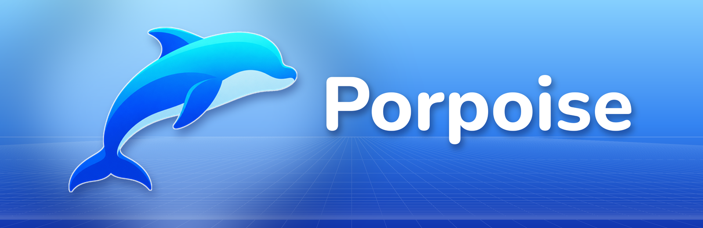

  

  
  
  
  

  <b>Porpoise</b> is a native GameCube and Wii emulator for jailbroken PS5, powered by
  <a href="https://dolphin-emu.org">Dolphin</a>. 
  Its launcher was built from scratch for the TV and the DualSense: sky-blue glass, a cover-flow shelf of real box art, memory cards you can
  hold, and original menu music.

  <a href="https://github.com/elripalda/Porpoise/releases/latest"><b>Download Porpoise 1.0</b></a> ·
  <a href="#install">Install</a> ·
  <a href="#controls">Controls</a> ·
  <a href="BUILDING.md">Build from source</a> ·
  <a href="CREDITS.md">Credits</a>

---

## Why Porpoise

Porpoise is not a front end bolted onto a general-purpose emulator menu. It is a
single-purpose app with its own home-screen tile and its own look, inspired by
the console menus of the early 2000s. It is meant to be picked up with a
controller and enjoyed from the couch.

- **Made for one job.** One emulator and one library, with settings written in
  plain words. There are no core lists and no config files to edit.
- **Native on PS5.** Porpoise is a real PS5 title (`PPSA99764`). Dolphin's
  x86-64 JIT runs directly on the console's CPU, and graphics go through Vulkan
  on Mesa's RADV driver.
- **Your games, presented well.** Box art, back covers, disc labels and game
  details download automatically, so your library looks like a shelf of boxes
  instead of a list of file names.

## Features

### The library
- **Cover-flow shelf:** a row of glass box-art tiles in a perspective grid room.
  The focused box lifts and turns to show its edge, with gloss and a slow
  reflection across the glass.
- **Finds your games on its own.** Porpoise searches the usual folders and every
  USB or extended drive. You can also add folders with the built-in folder
  browser, and it searches four levels deep.
- **Game formats:** `.iso`, `.gcm`, `.rvz`, `.ciso`, `.gcz`, `.wbfs` and `.wia`.
- **Sort** by title (A–Z) or by recently played. Each game shows when you last
  played it.

### Box art and game info
- **Automatic box art from [GameTDB](https://www.gametdb.com).** Full front and
  back covers in the 5:7 box shape, plus the disc's label art. Covers appear one
  by one as they arrive, with a "Getting covers 3 of 9" note while they load.
- **Game details:** description, developer, publisher, release date, genre,
  number of players and rating, from GameTDB's open database.
- **Use your own art.** Drop a PNG named after the game's disc ID into the
  covers folder and Porpoise uses it.
- Covers and info can each be turned off under **Settings → Games**.

### The details page
- **Square** flies the box off the shelf into Details, turning it over once on
  the way.
- **Triangle** flips to the **back cover**, and the **right stick** turns the box
  in your hands.
- **L2 / R2** swipe to the previous or next game without leaving Details.
- The disc spins beside the box, showing its real label art.
- **Play**, **Game settings** and **Save data** are one press away. A game with
  its own settings is marked *Custom*.

### Memory cards
- **Slot A and Slot B**, side by side like a classic memory-card manager. Each
  save shows its own icon on a glass tile.
- A banner bar shows the save's banner, title, description, block count and date,
  and each slot shows its free blocks.
- **Copy** a save to the other slot with **Square**, and **delete** it with
  **Triangle**. Both ask first, with *Cancel* selected by default.
- **Save data** on a game's Details page jumps straight to that game's save.

### Controllers and players
- **Up to four players.** Every controller signed in to a PS5 user is a player:
  turn on a second controller, pick a user for it, and it joins, even in the
  middle of a game.
- **Three button layouts.** *GameCube* (the default: Cross is A, Square is B,
  as on the GameCube pad), *PlayStation* (Cross is A, Circle is B) and *Custom*.
- **Customize buttons** shows a picture of the DualSense with the GameCube
  button each control plays. Pick a GameCube button, press the DualSense button
  you want, and the two swap places so nothing is ever left without a button.
- Any game can have its own layout, and analog L and R follow the triggers.

### Settings
Settings open on a rail of sections; inside each section, rows show their value
as chips.

| Section | What's inside |
|---|---|
| **Video** | Internal resolution (1080p by default; 4x and above marked *experimental*), widescreen hack, aspect ratio, anisotropic filtering, texture filtering, anti-aliasing (MSAA/SSAA), output resampling, smooth or sharp scaling, FPS counter |
| **Graphics** | Shader compilation (asynchronous ubershaders by default, for stutter-free play), texture cache accuracy, per-pixel lighting, disable fog, crop overscan, custom texture packs, skip duplicate frames |
| **Audio** | Game volume and mute; **menu music** and **menu sounds**, each with its own switch and volume |
| **Controls** | Button layout (GameCube, PlayStation or Custom), Customize buttons, vibration, connected controllers |
| **System** | Emulated CPU clock (50–300%), dual core, fast disc loading, cheats, console language, progressive scan |
| **Games** | Find games automatically, add or remove game folders, search again, download covers, download game info |
| **Interface** | Menu language, reduced motion, larger text, **reset all settings** |
| **About** | Version and credits |

- **Per-game settings.** Any game can override the Video, Graphics, Audio, Controls
  and System settings. Changed values show in blue, and *This game → Reset to
  default* clears them.
- **Reset all settings** puts Porpoise back the way it ships. Your games,
  folders and saves are kept.

### In-game menu
Press **Options + touch pad** together while playing. The game pauses and a
glass menu slides in from the left:

- **Resume**
- **Internal resolution**, **Widescreen**, **FPS counter**, **Upscaling** and
  **Volume**. Changes apply immediately and are saved for that game.
- **Quit to library:** back to the shelf without leaving Porpoise.
- **Close Porpoise:** back to the PS5 home screen.

When you resume, the game ignores your buttons until you let go, so the press
that closed the menu never reaches the game.

### Music and sound
- An **original menu soundtrack** that loops seamlessly. It fades in on the
  menus, fades out when a game starts, and returns when you quit to the library.
- **Original sound effects** for browsing games, scrolling menus, switching tabs,
  flipping the box and launching a game. The in-game menu has them too.
- Music and effects each have their own switch and volume. The music starts as a
  quiet bed at 40%.

### Languages
- English, **Español**, **Français** and **Português**. Porpoise follows your
  PS5's system language, and **Settings → Interface → Language** overrides it.
- More languages are coming in a future update.
- Want to fix a line without waiting for an update? Create
  `/data/porpoise/lang/es.txt` (or `fr.txt`, `pt.txt`) with lines such as
  `Quit to library = Volver a la biblioteca`.

### Performance
- **Locked to your TV's refresh.** When the display allows it, every frame is
  shown on its own vblank for smooth, even motion. Otherwise Porpoise keeps its
  own clock. Either way games run at their real speed, never above 60 fps, with
  clean 48 kHz sound.
- **Stutter-free shaders.** Dolphin compiles shaders in the background with
  asynchronous ubershaders, so a game doesn't stall the first time it draws
  something new.
- Dolphin's x86-64 JIT with fastmem, and Vulkan through RADV.

## Requirements

- A PS5 able to run homebrew, with **etaHEN** and **kstuff** loaded and
  **ShadowMountPlus** (or your usual method) to register homebrew titles.
- A way to copy files to the console: FTP, or a tool such as PS5 Upload.
- **Your own games**, as backups you made from discs you own. Porpoise
  includes no games and no system files of any kind.
- Optional: an internet connection on the console, for box art and game info.

## Install

1. Download **`Porpoise-1.0.zip`** from the
   [latest release](https://github.com/elripalda/Porpoise/releases/latest) and
   unzip it. You get a folder named **`PPSA99764`**.
2. Copy that folder to **`/data/homebrew/PPSA99764/`** on the console.
3. Register it the way you register your other homebrew (for example with
   ShadowMountPlus). The Porpoise tile appears on the home screen.
4. Put your game files in **`/data/porpoise/games/`**, or in any of the folders
   listed under [Adding games](#adding-games), and open Porpoise.

### Updating
ShadowMountPlus keeps serving the old copy until it is removed. **Delete
`/data/homebrew/PPSA99764/`, then upload the new folder.** Your games, saves,
covers and settings live in `/data/porpoise/` and are not touched. Check
**Settings → About** to confirm the version.

## Adding games

With **Find games automatically** on (the default), Porpoise looks in:

- `/data/porpoise/games`
- `/data/games`, `/data/GameCube`, `/data/Wii`, `/data/roms`, `/data/iso`
- the root of every USB drive (`/mnt/usb0`–`/mnt/usb7`) and extended storage
  (`/mnt/ext0`, `/mnt/ext1`)

To use any other folder, go to **Settings → Games → Add a game folder**, browse
to it, and press **Square**. Porpoise searches that folder and four levels
below it. After copying new games, use **Search for games now**.

## Controls

### Launcher

| Button | Library | Details | Memory cards |
|---|---|---|---|
| D-pad / left stick | Browse games | Choose an action | Move between saves and slots |
| **Cross** | Play | Confirm | – |
| **Circle** | – | Back to the library | Back |
| **Square** | Open Details | – | Copy to the other slot |
| **Triangle** | Sort | Front / back of the box | Delete |
| **L2 / R2** | – | Previous / next game | – |
| **Right stick** | – | Turn the box | – |
| **L1 / R1** | Switch tabs: Library, Memory Cards, Settings | | |

### In a game

| Button | Action |
|---|---|
| **Options + touch pad** | Pause and open the in-game menu |
| **Circle** (in the menu) | Resume |

With the default **GameCube** layout:

| GameCube | DualSense |
|---|---|
| A / B / X / Y | Cross / Square / Circle / Triangle |
| Z | R1 |
| L / R (analog) | L2 / R2 |
| Start | Options |
| Control stick / C-stick | Left stick / right stick |
| D-pad | D-pad |

The **PlayStation** layout puts B on Circle and X on Square. To set any button
yourself, go to **Settings → Controls → Customize buttons**.

**More players:** turn on another controller and choose a PS5 user for it. It
becomes the next player, up to four, and can join in the middle of a game.

## Where things are kept

| Path | What |
|---|---|
| `/data/homebrew/PPSA99764/` | The app. Replace it to update. |
| `/data/porpoise/games/` | A good place for your game files |
| `/data/porpoise/covers/` | Box art, back covers and disc art (`<disc ID>.png`); replace any with your own |
| `/data/porpoise/saves/` | Dolphin's data, including the memory cards (`User/GC/<region>/Card A`, `Card B`) |
| `/data/porpoise/game-settings/` | Each game's own settings |
| `/data/porpoise/info.tsv` | Downloaded game details |
| `/data/porpoise/lang/` | Your own translation fixes (optional) |

## Troubleshooting

- **Still seeing the old version after updating?** Delete
  `/data/homebrew/PPSA99764/` completely before uploading the new folder.
- **No covers?** The console needs to be online when Porpoise opens, and
  **Settings → Games → Download covers** must be on. A few discs have no art on
  GameTDB. You can add your own.
- **Something went wrong?** These two files help when you report a problem:
  - `/data/homebrew/PPSA99764/trace.txt`
  - `/data/homebrew/PPSA99764/porpoise/core.log` (records the game's real speed
    every 10 seconds)

Please [open an issue](https://github.com/elripalda/Porpoise/issues) with your
console firmware, the game's disc ID and those logs.

## Known limitations in 1.0

- Wii support is experimental. Games that need Wii Remote pointing or motion
  aren't practical on a DualSense yet.
- Save states, netplay and achievements aren't part of Porpoise.
- Memory-card copy and delete work on saves Dolphin keeps as files (the normal
  `Card A` and `Card B` folders).

## Build from source

Porpoise builds on Linux or WSL with clang 18, Mesa's RADV driver for PS5 and
the PS5 payload SDK. See **[BUILDING.md](BUILDING.md)**.

## Credits

Porpoise was created by **Ruben ([@elripalda](https://www.elripalda.com))**:
the design, the launcher, the logo, the menu music and the sound effects.

It stands on the work of many people. The full list, with licences, is in
**[CREDITS.md](CREDITS.md)**:

- **[Dolphin](https://dolphin-emu.org)** by the Dolphin Emulator Project, the
  emulator itself, and the **[libretro Dolphin core](https://github.com/libretro/dolphin)**.
- **[libretro / RetroArch](https://www.libretro.com)**, whose API Porpoise uses to host Dolphin.
- **Mihawk's [PS5 RetroArch](https://github.com/mihawk-99/PS5_RetroArch)**,
  **[PS5_Vulkan](https://github.com/mihawk-99/PS5_Vulkan)** and
  **[PS5_Mesa](https://github.com/mihawk-99/PS5_Mesa)**: the PS5 Dolphin port,
  the platform layer and Vulkan on PS5 through **[Mesa](https://mesa3d.org)'s RADV**.
- **[ps5-payload-sdk](https://github.com/ps5-payload-dev/sdk)** by John Törnblom
  and contributors, and **BlackBearReloaded**'s native title pipeline.
- **[GameTDB](https://www.gametdb.com)** and its contributors, for the box art
  and game details.
- **[Nunito](https://github.com/googlefonts/nunito)** (SIL OFL) and
  **[stb](https://github.com/nothings/stb)** by Sean Barrett.
- The PS5 scene: **etaHEN**, **kstuff** and **ShadowMountPlus**, and the front
  ends **PS5SX2** and **ProsperoEden** for the inspiration.

## Legal

> [!IMPORTANT]
> **Porpoise does not condone piracy.** It contains no games, no console BIOS,
> IPL or firmware files, and no decryption keys, and none will ever be provided
> or linked to. Play only games you own, as backups you made from your own discs.

Porpoise is an independent, free and open-source project. It is **not
affiliated with, endorsed by or sponsored by Nintendo or Sony Interactive
Entertainment**, and it contains no code, artwork, sounds or other material from
either. *Nintendo*, *GameCube* and *Wii* are trademarks of Nintendo.
*PlayStation* and *PS5* are trademarks of Sony Interactive Entertainment Inc.
These names are used only to describe compatibility.

Emulation is provided by Dolphin (GPL-2.0-or-later). Box art and game details
are downloaded on your console from GameTDB and are not distributed with
Porpoise.

## License

Porpoise is free software, licensed under the
**[GNU General Public License v3.0 or later](LICENSE)**. Parts carried over
from other projects keep their own notices. Every component that ships in the
app, with its licence and exact source revision, is listed in
`licenses/README.txt` inside the release and in [CREDITS.md](CREDITS.md).

Made with care by <a href="https://www.elripalda.com">@elripalda</a>.

